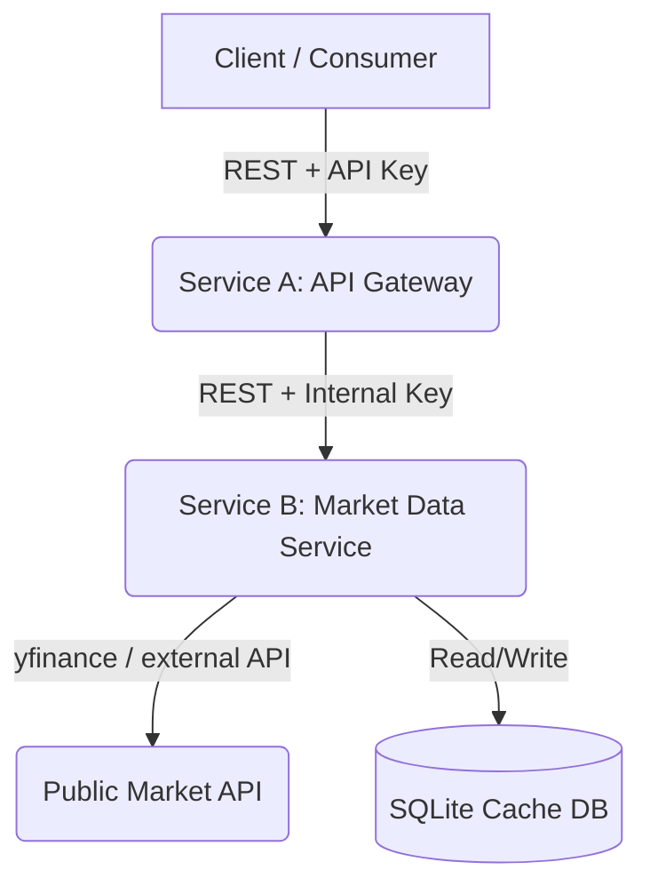

# Project Plan: FinAPI Backend System

This document outlines the architecture, infrastructure requirements, and implementation plan for building the multi-service market-data REST API project.

---

## 1. Architecture Definition

The system is split into two primary Python services that communicate over REST, with an optional third signal service.

### Component Details

#### Service A — API Gateway / Backend
* **Purpose**: Serves as the public-facing entry point, handles authorization, routes requests, and returns normalized data.
* **Technology**: Python with **FastAPI**.
* **Key Responsibilities**:
  * Implements bearer token validation using the `Authorization: Bearer <key>` header.
  * Rejects unauthorized requests with `HTTP 401 Unauthorized`.
  * Calls Service B over REST to fetch raw/normalized market snapshot.
  * Ensures that raw credentials and upstream endpoints are never exposed.

#### Service B — Market Data Service
* **Purpose**: Manages external data integration, response normalization, caching, and service-to-service security.
* **Technology**: Python with **FastAPI** + **yfinance** + **SQLite (SQLAlchemy/SQLModel)**.
* **Key Responsibilities**:
  * Validates the internal API key sent from Service A.
  * Fetches real-time ticker data using the `yfinance` library.
  * Normalizes the external `yfinance` payloads to a stable, internal schema.
  * Caches responses in SQLite with a configurable TTL (e.g., 5 minutes) to avoid rate limits and reduce upstream latency.
  * Implements resilience features (connection timeouts, retry logic).

---

## 2. Infrastructure Requirements

1. **Local Python Environment**:
   - Python 3.11 or higher.
   - Package management: `pip` with `requirements.txt` (isolated dependency files for Service A and Service B).
2. **Containerization**:
   - Individual `Dockerfile` files for Service A and Service B.
   - A root-level `docker-compose.yml` to run the entire stack with local networking, mapping ports (`8000` for Service A, `8001` for Service B).
3. **Configuration**:
   - Environment variables (stored in `.env` and loaded at runtime) containing API keys and endpoints.
   - Env files are ignored from git to prevent credential leakage.

---

## 3. GitHub & Repository Strategy

1. **Repository Setup**:
   - Initialize git locally: `git init`.
   - Set up local user identity details.
   - Create a `.gitignore` to prevent committing env variables, databases, and dependencies.
2. **Authentication & Remote**:
   - Authenticate with GitHub using the provided Personal Access Token (PAT).
   - Create the `finapi` repository on GitHub via the API.
   - Add the remote origin: `https://github.com/bobev18/finapi.git` (authenticated).
3. **Commit Workflow**:
   - Commit 1: Initial repository scaffolding (`.gitignore`, `PLAN.md`, `OBJECTIVE.md`).
   - Commit 2: Docker Compose skeleton and env config.
   - Commit 3: Service B development (yfinance integration + normalization + internal endpoint).
   - Commit 4: Service B local caching (SQLite storage with TTL).
   - Commit 5: Service A development (API key verification + inter-service client).
   - Commit 6: End-to-end testing, curl examples, and final README documentation.
