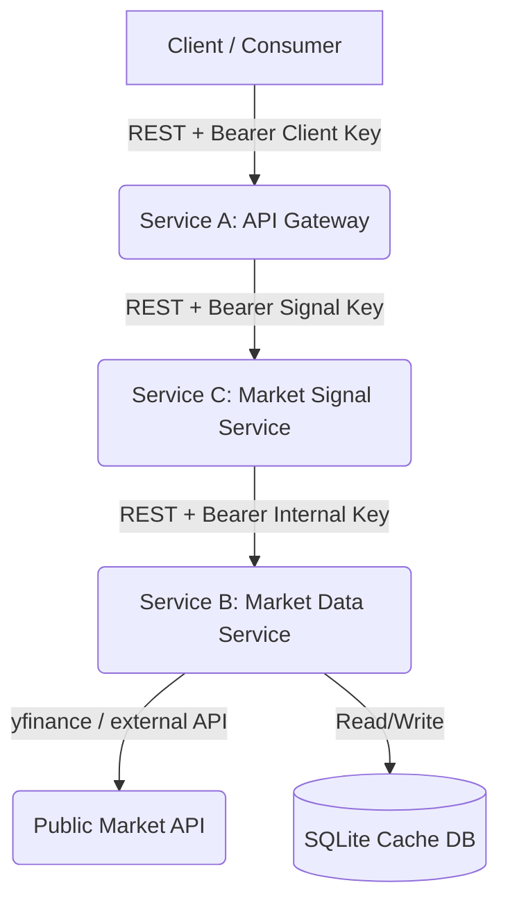

# Project Plan: FinAPI Backend System

This document outlines the architecture, infrastructure requirements, and implementation plan for building the multi-service market-data REST API project.

---

## 1. Architecture Definition

The system is split into three primary Python services that communicate over REST.

### Component Details

#### Service A — API Gateway / Backend
* **Purpose**: Serves as the public-facing entry point, handles authorization, routes requests, and returns normalized data.
* **Technology**: Python with **FastAPI**.
* **Key Responsibilities**:
  * Implements bearer token validation using the `Authorization: Bearer <key>` header.
  * Rejects unauthorized requests with `HTTP 401 Unauthorized`.
  * Calls Service C over REST to fetch the derived market signal, or Service B for raw snapshots.
  * Ensures that raw credentials and upstream endpoints are never exposed.

#### Service C — Market Signal Service
* **Purpose**: Performs rule-based calculations on market snapshots to produce sentiment signals.
* **Technology**: Python with **FastAPI**.
* **Key Responsibilities**:
  * Validates internal Bearer token (`SIGNAL_API_KEY`) from Service A.
  * Fetches the market snapshot from Service B over REST.
  * Derives a bullish/bearish/neutral signal based on daily percentage price change.
  * Labels signals as rule-based and appends financial advice disclaimer.

#### Service B — Market Data Service
* **Purpose**: Manages external data integration, response normalization, caching, and service-to-service security.
* **Technology**: Python with **FastAPI** + **yfinance** + **SQLite (SQLAlchemy/SQLModel)**.
* **Key Responsibilities**:
  * Validates the internal API key sent from Service A.
  * Fetches real-time ticker data using the `yfinance` library.
  * Normalizes the external `yfinance` payloads to a stable, internal schema.
  * Caches responses in SQLite with a configurable TTL (e.g., 5 minutes) to avoid rate limits and reduce upstream latency.
  * Implements resilience features (connection timeouts, retry logic).

---

## 2. Infrastructure Requirements

1. **Local Python Environment**:
   - Python 3.11 or higher.
   - Package management: `pip` with `requirements.txt` (isolated dependency files for Service A and Service B).
2. **Containerization**:
   - Individual `Dockerfile` files for Service A and Service B.
   - A root-level `docker-compose.yml` to run the entire stack with local networking, mapping ports (`8000` for Service A, `8001` for Service B).
3. **Configuration**:
   - Environment variables (stored in `.env` and loaded at runtime) containing API keys and endpoints.
   - Env files are ignored from git to prevent credential leakage.

---

## 3. GitHub & Repository Strategy

1. **Repository Setup**:
   - Initialize git locally: `git init`.
   - Set up local user identity details.
   - Create a `.gitignore` to prevent committing env variables, databases, and dependencies.
2. **Authentication & Remote**:
   - Authenticate with GitHub using the provided Personal Access Token (PAT).
   - Create the `finapi` repository on GitHub via the API.
   - Add the remote origin: `https://github.com/bobev18/finapi.git` (authenticated).
3. **Commit Workflow**:
   - Commit 1: Initial repository scaffolding (`.gitignore`, `PLAN.md`, `OBJECTIVE.md`).
   - Commit 2: Docker Compose skeleton and env config.
   - Commit 3: Service B development (yfinance integration + normalization + internal endpoint).
   - Commit 4: Service B local caching (SQLite storage with TTL).
   - Commit 5: Service A development (API key verification + inter-service client).
   - Commit 6: Service B previous close database model & normalization updates.
   - Commit 7: Service C development (rule-based signal calculations + Service B client).
   - Commit 8: Service A update to integrate Service C Client and market-signal endpoint.
   - Commit 9: Service orchestration via Docker Compose, env configs, and README updates.

---

## 4. Refinement & Hardening Tasks (Addressing Weaknesses)

1. **Contract Enforcement / DTO Validation at Boundaries**:
   - Share or duplicate the `MarketSnapshot` Pydantic model across services.
   - Update service clients in `service_a` and `service_c` to deserialize and validate responses against the Pydantic schema, eliminating raw dictionary access.
2. **SRP Alignment for Data Normalization**:
   - Refactor `EodhdProvider` in `service_b` to use a dedicated normalizer function in `normalizer.py`, matching the SRP pattern of `YFinanceProvider`.
3. **Resilience & Fault Tolerance Refinements**:
   - Refactor retry logic in `service_b` providers to fail-fast on client-side errors (e.g., bypass retries when a ticker is invalid/not found, preventing 3-second latency penalties).
   - Add a circuit breaker pattern or provider health state to dynamically bypass a failing primary provider when it is known to be offline.
4. **Numeric Falsy Checking Bug Fixes**:
   - Fix `normalizer.py` to use explicit `is not None` checks instead of Python `or` operators for numeric fields (e.g., `volume`, `high`, `low`, `open` where `0.0` is a valid number).
5. **Dependency Isolation**:
   - Separate the root `requirements.txt` into service-specific dependency files to optimize Docker build times and minimize container image footprint.
