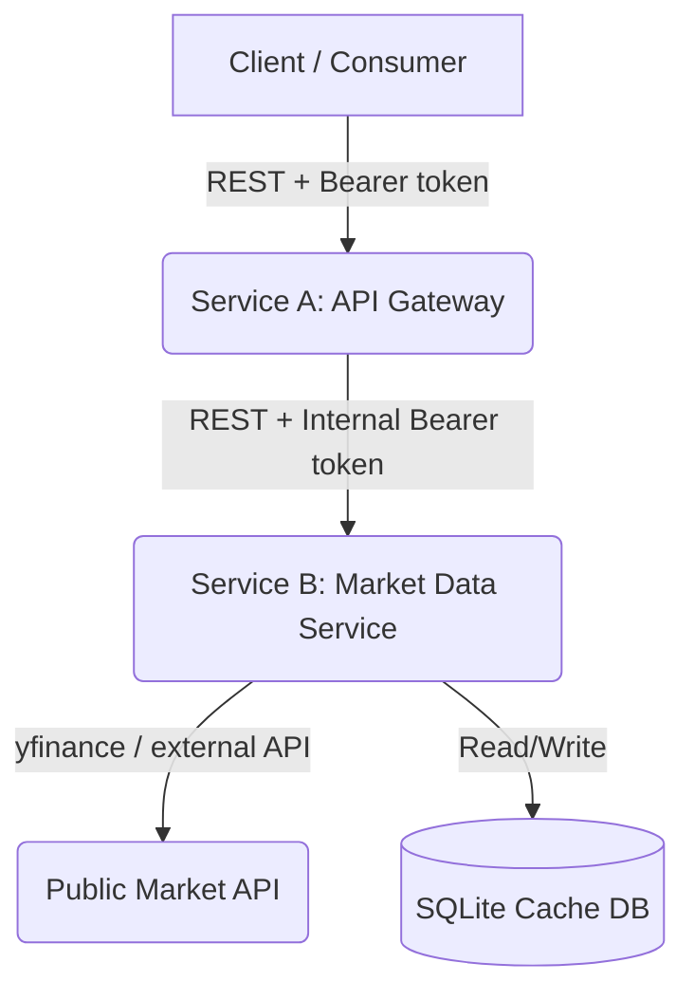

# FinAPI: Multi-Service Market Data Backend

FinAPI is a secure, resilient, multi-service backend system built in Python using FastAPI. It exposes a client-facing REST API gateway, protects endpoint access with API Key Bearer authentication, and integrates with Yahoo Finance (`yfinance`) for market data retrieval.

The project is structured as a two-service architecture to separate concerns, enforce clean boundaries, and implement localized caching to prevent external API rate-limiting.

---

## Architecture Overview



### 1. Service A — API Gateway (Port `8000`)
* **Role**: Public-facing entry point.
* **Responsibilities**:
  * Validates client Bearer API keys (`Authorization: Bearer <key>`).
  * Rejects unauthenticated requests with `HTTP 401 Unauthorized`.
  * Proxies authorized requests to Service B over internal REST.
  * Ensures external clients have no direct visibility or access to upstream API engines or database layers.

### 2. Service B — Market Data Service (Port `8001`)
* **Role**: Internal integration layer.
* **Responsibilities**:
  * Protects internal endpoints with a separate internal Bearer token.
  * Interacts with `yfinance` to fetch real-time stock or crypto details.
  * Normalizes the external payloads into a stable, internal `MarketSnapshot` schema.
  * Caches responses in a local SQLite database with a configurable Time-to-Live (TTL) to limit external API pressure and minimize response latency.
  * Employs timeout and retry resilience for upstream HTTP requests.

---

## Technical Stack
- **Framework**: FastAPI (Python 3.12)
- **Data Modeling / ORM**: Pydantic v2 & SQLModel (SQLAlchemy)
- **Market Integration**: `yfinance`
- **Dependency Manager**: `uv`
- **Containerization**: Docker & Docker Compose

---

## Setup & Running

### 1. Configure Environment Variables
Copy the template configuration and customize if needed:
```bash
cp .env.example .env
```
Default keys are pre-configured:
* `CLIENT_API_KEY=test_client_key` (used by clients to call Service A)
* `INTERNAL_API_KEY=test_internal_key` (used by Service A to call Service B)
* `CACHE_TTL_SECONDS=300` (5-minute cache expiration)

---

### Option A: Run via Docker Compose (Recommended)
You can run both services together using Docker Compose:
```bash
docker compose up --build
```
* **Service A (Gateway)** is exposed publicly at: `http://localhost:8000`
* **Service B (Internal)** is exposed internally/locally at: `http://localhost:8001`
* The cache database is persisted under a volume named `cache_data`.

---

### Option B: Run Locally with `uv`
If you prefer running the services directly in your local environment:

1. **Install Dependencies**:
   Ensure `uv` is installed, then run:
   ```bash
   uv venv
   uv pip install -r requirements.txt
   ```

2. **Start Service B (Market Data)**:
   ```bash
   # In Windows PowerShell:
   $env:PORT="8001"
   $env:INTERNAL_API_KEY="test_internal_key"
   $env:DATABASE_URL="sqlite:///market_cache.db"
   uv run uvicorn service_b.app.main:app --port 8001
   ```

3. **Start Service A (Gateway)**:
   ```bash
   # In Windows PowerShell:
   $env:PORT="8000"
   $env:CLIENT_API_KEY="test_client_key"
   $env:INTERNAL_API_KEY="test_internal_key"
   $env:SERVICE_B_URL="http://localhost:8001"
   uv run uvicorn service_a.app.main:app --port 8000
   ```

---

## Running Tests
Unit and integration tests are written using `pytest` and mock external calls to Yahoo Finance and SQLite.
Run the complete test suite:
```bash
uv run pytest
```

---

## API Request Examples

### 1. Successful Request to Gateway (Service A)
Request a normalized snapshot for Apple (`AAPL`):
```bash
curl -i -H "Authorization: Bearer test_client_key" "http://localhost:8000/api/v1/market-snapshot?symbol=AAPL"
```

**Expected Response (HTTP 200)**:
```json
{
  "symbol": "AAPL",
  "name": "Apple Inc.",
  "price": 175.50,
  "currency": "USD",
  "high": 176.00,
  "low": 174.00,
  "open": 174.50,
  "volume": 52000000.0,
  "market_cap": 2700000000000.0,
  "timestamp": 1700000000.0
}
```

### 2. Unauthorized Requests (Service A)
Requests without a valid Bearer token are rejected:
```bash
# Missing token
curl -i "http://localhost:8000/api/v1/market-snapshot?symbol=AAPL"

# Invalid token
curl -i -H "Authorization: Bearer wrong_key" "http://localhost:8000/api/v1/market-snapshot?symbol=AAPL"
```
**Expected Response (HTTP 401 Unauthorized)**:
```json
{
  "detail": "Unauthorized: Invalid or missing token"
}
```

### 3. Direct Request to Internal Service B (For Testing)
To query the isolated internal data service directly:
```bash
curl -i -H "Authorization: Bearer test_internal_key" "http://localhost:8001/internal/market-data?symbol=BTC-USD"
```
*(Direct client access should be blocked in production environments by restricting firewall rules on port `8001`).*
