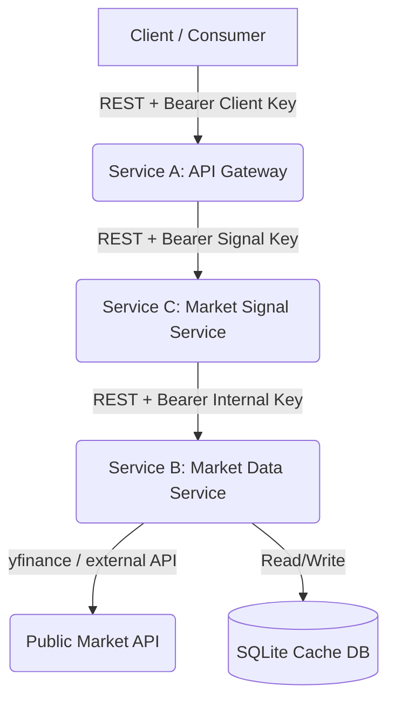

# System Patterns: FinAPI

This document describes the architectural layout, core technical stack, and design patterns utilized in FinAPI.

## Technology Stack
- **Languages/Runtime**: Python 3.11+
- **Web Framework**: FastAPI (Async-capable, automatic docs, type validation via Pydantic)
- **Database / Cache**: SQLite (via SQLAlchemy/SQLModel for lightweight ORM access)
- **Market Integration**: `yfinance` (for querying Yahoo Finance)
- **Dependency Management**: `pip` (or `uv` as preferred by the user config)
- **Containerization**: Docker & Docker Compose

## Core Architecture

### Clean Service Separation
1. **Service A (Gateway)**:
   - Exposes public-facing endpoints (e.g., `/api/v1/market-snapshot`, `/api/v1/market-signal`).
   - Validates client credentials.
   - Forwards requests to Service B (for data) or Service C (for signals).
   - Shields internal services from direct public access.
2. **Service C (Market Signal Service)**:
   - Exposes internal `/internal/market-signal` endpoint.
   - Validates signal token from Service A.
   - Queries Service B to fetch market snapshots.
   - Applies rule-based pricing changes to derive bullish/bearish/neutral signals.
3. **Service B (Market Data Service)**:
   - Exposes internal `/internal/market-data` endpoint.
   - Validates internal service credentials from Service C or Service A.
   - Calls `yfinance` to fetch stock or crypto data.
   - Handles cache read/writes in SQLite database with a configurable TTL.
   - Normalizes raw payloads into a clean `MarketSnapshot` DTO including previous close.

## Design & Code Patterns
- **SOLID Principles**: Each class/endpoint has a single responsibility. Interfaces represent abstract data fetches.
- **TDD (Test-Driven Development)**: Write failing tests before writing production code.
- **Encapsulation**: Private class properties, clear interfaces, configuration driven by environment variables.
- **DTOs / Schema Normalization**: Use Pydantic models to define the contract between services, ensuring stable APIs regardless of changes in raw `yfinance` payloads.
- **Resilience**: Client sessions with retries, timeouts, and fallback to cache if the upstream service is offline or rate-limiting.
